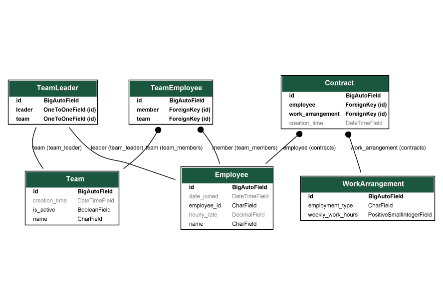

# Employee management system
 
It is a sample code project for demonstration purpose.

### Introduction:

We are allowing companies to be organized in separate teams of employees with one team leader per team. Every employee has an
hourly rate they get paid for their work. Not everybody in the company is a full time employee. Team
leaders are paid an additional 10% for their work. 

### Database table structure:

